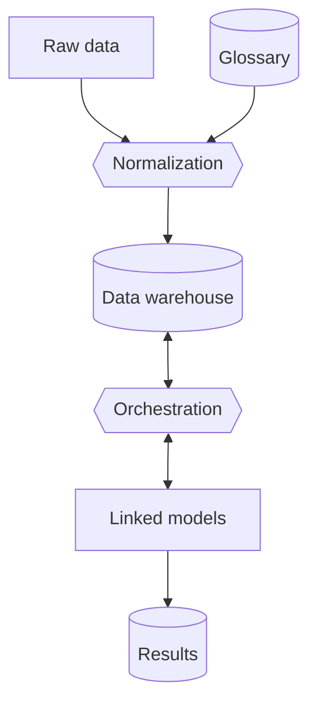

# sentier.dev

This repository is used for discussing, planning, and implementing the sentier.dev open infrastructure for quantitative sustainability assessment framework.

## Development philosophy

The premise of our work is that we can't get quantitative sustainability assessment without broad participation across society. Similar to projects like OpenStreetMap and Wikipedia, most of the content will be contributed by volunteers. Our job is to make this as easy and rewarding as possible.

Our development processes should be equally positive and welcoming. The code is FOSS, but we also do project and product management in the open, and do our best to lower barriers so that people at different experience levels can contribute.

Participation in sentier.dev is governed by a code of conduct (`CODE_OF_CONDUCT.md`).

## Overview

## Idea lifecycle

You want to contribute? That's awesome! We need your ideas, your energy, and your voice to help us make products which solve real user needs.

You should start by [searching the issues](https://github.com/Depart-de-Sentier/sentier.dev/issues?q=is%3Aissue) to see if someone has suggested a similar idea in the past. If so, you should be able to see how that suggestion was resolved.

If you didn't find something similar you can create a new issue.

## Licensing

See `LICENSES`. Source code is MIT, other content is CC-BY.