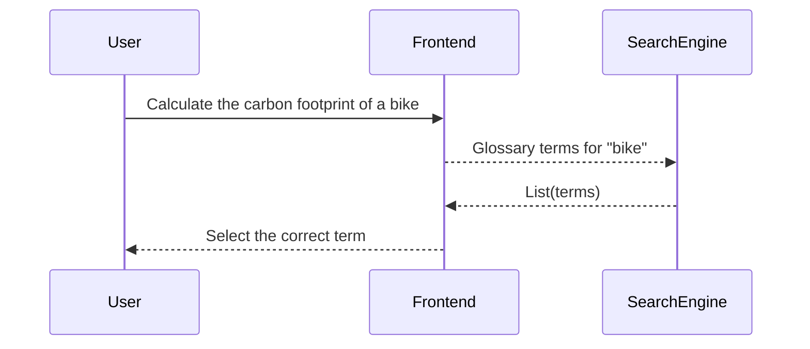
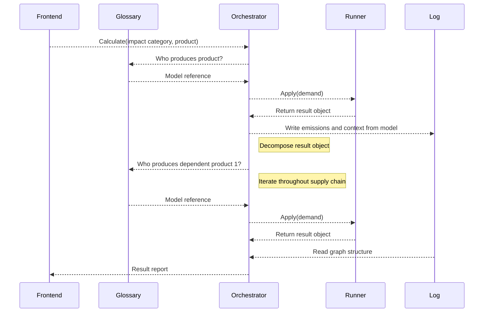

# Sequnce diagrams

Selecting a product from natural text query:

```mermaid
sequenceDiagram
    User->>Frontend: Calculate the carbon footprint of a bike
    Frontend-->>SearchEngine: Glossary terms for "bike"
    SearchEngine-->>Frontend: List(terms)
    Frontend-->>User: Select the correct term
```

Running a calculation from the perspective of the orchestrator:

```mermaid
sequenceDiagram
    participant Frontend
    participant Glossary
    participant Orchestrator
    participant Runner
    participant Log
    Frontend-->>Orchestrator: Calculate(impact category, product)
    Orchestrator-->>Glossary: Who produces product?
    Glossary-->>Orchestrator: Model reference
    Orchestrator-->>Runner: Apply(demand)
    Runner-->>Orchestrator: Return result object
    Orchestrator-->>Log: Write emissions and context from model
    Note right of Orchestrator: Decompose result object
    Orchestrator-->>Glossary: Who produces dependent product 1? 
    Note right of Orchestrator: Iterate throughout supply chain
    Glossary-->>Orchestrator: Model reference
    Orchestrator-->>Runner: Apply(demand)
    Runner-->>Orchestrator: Return result object
    Log-->>Orchestrator: Read graph structure
    Orchestrator-->>Frontend: Result report
```
