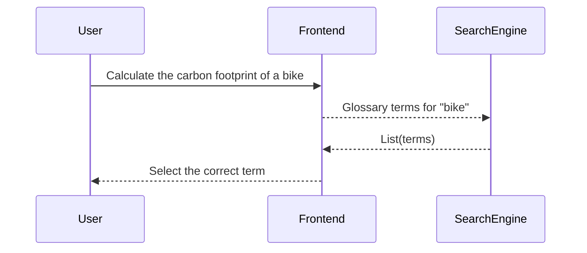
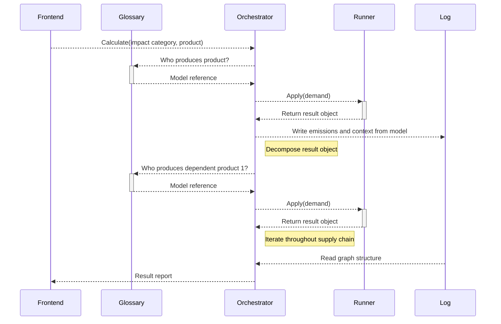
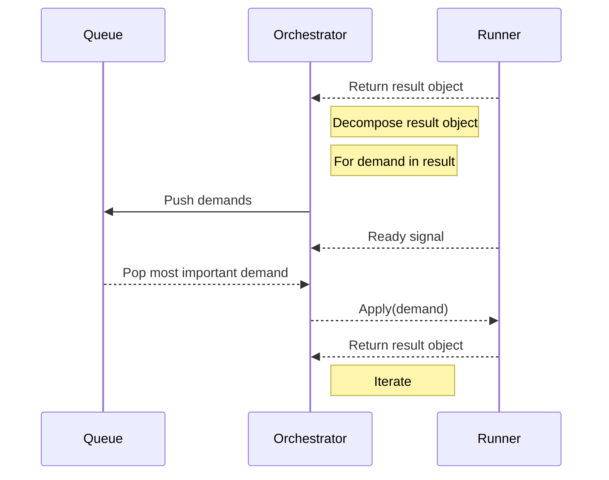

# Sequence diagrams

The diagrams were built with the following hypothesis as basis:

+ Orchestration service will launch containerization (docker/podman/runc) objects
+ models are serialized under a filesystem with standard structure:
```

models.sentier.dev
└── a_model_URI
    └── python
        ├── extract.py
        ├── load.py
        ├── prepare.py
        └── transform.py

```
+  The orchestrator has the responsibility of keeping track of the "graph" of models being called (to be returned after call)
+  The orchestrator has the responsibility of "calling" the other models (from the results above)
+  calling a model returns:
	- other necessary models
	- emissions

Selecting a product from natural text query:



Running a calculation from the perspective of the orchestrator:



Graph traversal:


